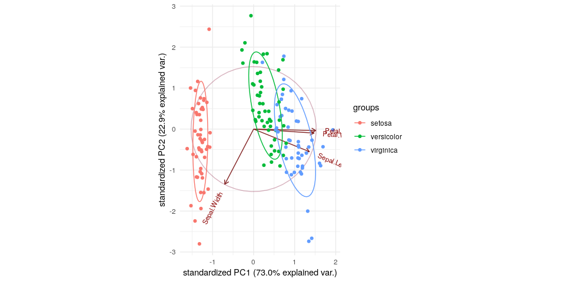

<!-- README.md is generated from README.Rmd. Please edit that file -->
datools 
========================================================

The goal of datools is to cover a lot of convenient tools useful for machine learning consulting using R

Build status
============

[](https://travis-ci.org/DoktorMike/datools) [](https://codecov.io/github/DoktorMike/datools?branch=master) [](https://app.wercker.com/project/byKey/82dcdeafb5fae145580366ca3f95fc6d) [](https://www.tidyverse.org/lifecycle/#maturing) [](https://doktormike.github.io/datools)

Installation
------------

You can install datools from github with:

``` r
# install.packages("devtools")
devtools::install_github("DoktorMike/datools")
```

Example
-------

Say you have a vector of weekdays and you would really like to have that one hot encoded for use in your algorithms then oneHotEncoder comes to the rescue!

``` r
## basic example code
library(datools)
library(lubridate)
#> 
#> Attaching package: 'lubridate'
#> The following object is masked from 'package:base':
#> 
#>     date
oneHotEncoder(x=wday(seq(as.Date("2017-10-07"), by ="days", length.out = 10), 
                     label = TRUE))
#>    Data Sun Mon Tue Wed Thu Fri Sat
#> 1   Sat   0   0   0   0   0   0   1
#> 2   Sun   1   0   0   0   0   0   0
#> 3   Mon   0   1   0   0   0   0   0
#> 4   Tue   0   0   1   0   0   0   0
#> 5   Wed   0   0   0   1   0   0   0
#> 6   Thu   0   0   0   0   1   0   0
#> 7   Fri   0   0   0   0   0   1   0
#> 8   Sat   0   0   0   0   0   0   1
#> 9   Sun   1   0   0   0   0   0   0
#> 10  Mon   0   1   0   0   0   0   0
```

PCA fun
-------

If you ever need to illustrate for your peers what sort of direction your original data is pointing to in the PCA space this function comes very much in handy.

``` r
library(datools)
data(iris)
plotPCAComponent(iris[,-5], iris$Species) + theme_minimal()
```


