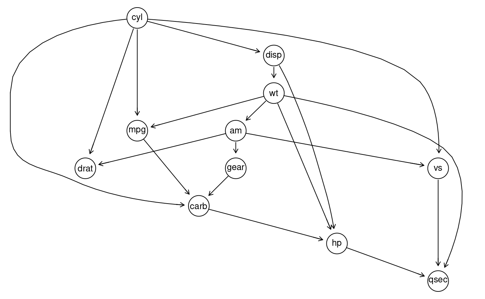

<!-- README.md is generated from README.Rmd. Please edit that file -->

# datools 

The goal of datools is to cover a lot of convenient tools useful for
machine learning consulting using R

# Build status

[](https://travis-ci.org/DoktorMike/datools)
[](https://codecov.io/github/DoktorMike/datools?branch=master)
[](https://app.wercker.com/project/byKey/82dcdeafb5fae145580366ca3f95fc6d)
[](https://www.tidyverse.org/lifecycle/#maturing)
[](https://doktormike.github.io/datools)

## Installation

You can install datools from github with:

``` r
# install.packages("devtools")
devtools::install_github("DoktorMike/datools")
```

Optionally you can also install the Rgraphviz package which is required
for the graph learning visualization.

``` r
if (!requireNamespace("BiocManager", quietly = TRUE))
    install.packages("BiocManager")
BiocManager::install("Rgraphviz")
```

## Example

Say you have a vector of weekdays and you would really like to have that
one hot encoded for use in your algorithms then oneHotEncoder comes to
the rescue\!

``` r
## basic example code
library(datools)
library(lubridate)
#> 
#> Attaching package: 'lubridate'
#> The following objects are masked from 'package:base':
#> 
#>     date, intersect, setdiff, union
oneHotEncoder(x=wday(seq(as.Date("2017-10-07"), by ="days", length.out = 10), 
                     label = TRUE))
#>    Data Sun Mon Tue Wed Thu Fri Sat
#> 1   Sat   0   0   0   0   0   0   1
#> 2   Sun   1   0   0   0   0   0   0
#> 3   Mon   0   1   0   0   0   0   0
#> 4   Tue   0   0   1   0   0   0   0
#> 5   Wed   0   0   0   1   0   0   0
#> 6   Thu   0   0   0   0   1   0   0
#> 7   Fri   0   0   0   0   0   1   0
#> 8   Sat   0   0   0   0   0   0   1
#> 9   Sun   1   0   0   0   0   0   0
#> 10  Mon   0   1   0   0   0   0   0
```

## PCA fun

If you ever need to illustrate for your peers what sort of direction
your original data is pointing to in the PCA space this function comes
very much in handy.

``` r
library(datools)
data(iris)
plotPCAComponent(iris[,-5], iris$Species) + theme_minimal()
```

<!-- -->

## Indices

Splitting up a data.frame or a tibble into N buckets of size K is
sometimes a hassle. The rangeToBuckets come to the rescue\! In this
example we’ll split up the mtcars dataset and perform a simple
regression on each subset of the data and show the results.

``` r
library(datools)
indsList <- rangeToBuckets(1:nrow(mtcars), 10)
sapply(indsList, function(x) coef(lm(mpg~disp, data=mtcars[x,])))
#>                    [,1]        [,2]        [,3]        [,4]
#> (Intercept) 25.56380288 33.09625946 29.13295921 25.70222222
#> disp        -0.02489719 -0.05094025 -0.03830431 -0.03555556
```

Of course we can make this nices by running more splits and making all
of it in one go

``` r
library(datools)
library(dplyr)
sapply(rangeToBuckets(1:nrow(mtcars), 4), 
       function(x) coef(lm(mpg~disp, data=mtcars[x,]))) %>% 
  t() %>% knitr::kable()
```

| (Intercept) |        disp |
| ----------: | ----------: |
|    22.71042 | \-0.0067663 |
|    27.65159 | \-0.0321575 |
|    25.80828 | \-0.0359579 |
|    24.71015 | \-0.0306960 |
|    35.85532 | \-0.0481161 |
|    25.64273 | \-0.0339446 |
|    30.76149 | \-0.0290120 |
|    23.85850 | \-0.0256362 |

## Discovering relationships in your dataset

Here we’ll look at some ways to detect dependencies and hierarchies
between your variables in a given dataset. As per usual we’ll use a
simple dataset that is available in R. The `mtcars` tadaaa\! Let’s
pretend you were given this dataset and have no clue how to best go
about things and you feel like exploring. So let’s start by looking at
the data.

``` r
data(mtcars)
sapply(mtcars, summary) %>% t()
#>        Min.   1st Qu.  Median       Mean 3rd Qu.    Max.
#> mpg  10.400  15.42500  19.200  20.090625   22.80  33.900
#> cyl   4.000   4.00000   6.000   6.187500    8.00   8.000
#> disp 71.100 120.82500 196.300 230.721875  326.00 472.000
#> hp   52.000  96.50000 123.000 146.687500  180.00 335.000
#> drat  2.760   3.08000   3.695   3.596563    3.92   4.930
#> wt    1.513   2.58125   3.325   3.217250    3.61   5.424
#> qsec 14.500  16.89250  17.710  17.848750   18.90  22.900
#> vs    0.000   0.00000   0.000   0.437500    1.00   1.000
#> am    0.000   0.00000   0.000   0.406250    1.00   1.000
#> gear  3.000   3.00000   4.000   3.687500    4.00   5.000
#> carb  1.000   2.00000   2.000   2.812500    4.00   8.000
```

So far so good. Now how do these guys relate to each other? Well we
could go about this by fitting every single linear model we could given
all variables. That still wouldn’t give us the hierarchy between all
variables though. So can we do better? Why yes, yes we can.

``` r
library(datools)
library(Rgraphviz)
library(bnlearn)
data(mtcars)
myfit<-discover_hierarchy_and_fit(mtcars)
graphviz.plot(myfit)
```

<!-- -->

So from this graph we can see that `qsec` is actually the last node in
the hierarchy. Regression wise this node is affected by a lot of other
variables but does not affect them in return. Notice here that we’re
only measuring correlation and graph factorization here. This is not a
proper causality claim, but it might be indicative of it.

We could have a look at a textual representation of this graph as well
if we’re not into visualizations.

``` r
arcs(myfit)
#>       from   to    
#>  [1,] "mpg"  "carb"
#>  [2,] "cyl"  "mpg" 
#>  [3,] "cyl"  "disp"
#>  [4,] "cyl"  "drat"
#>  [5,] "cyl"  "vs"  
#>  [6,] "cyl"  "carb"
#>  [7,] "disp" "hp"  
#>  [8,] "disp" "wt"  
#>  [9,] "hp"   "qsec"
#> [10,] "wt"   "mpg" 
#> [11,] "wt"   "hp"  
#> [12,] "wt"   "qsec"
#> [13,] "wt"   "am"  
#> [14,] "vs"   "qsec"
#> [15,] "am"   "drat"
#> [16,] "am"   "vs"  
#> [17,] "am"   "gear"
#> [18,] "gear" "carb"
#> [19,] "carb" "hp"
```

Say now that we want to know from this fit which variables `carb` is
affected by and by how much. In this case we simply look at

``` r
myfit$carb$coefficients
#> (Intercept)         mpg         cyl        gear 
#>  -2.7816679  -0.1439035   0.3959199   1.6367526
```

This can also be confirmed by running

``` r
coef(lm(carb~mpg+cyl+gear, data=mtcars))
#> (Intercept)         mpg         cyl        gear 
#>  -2.7816679  -0.1439035   0.3959199   1.6367526
```

in which you can see that the edges between each node is fitted with a
maximum likelihood estimation. This is not the model you would have
gotten even if you decided to model `carb` in a flat structure as
evident from:

``` r
coef(lm(carb~., data=mtcars))
#> (Intercept)         mpg         cyl        disp          hp        drat 
#> -2.46807501 -0.01378803  0.28536857 -0.01431005  0.01349808  0.41696616 
#>          wt        qsec          vs          am        gear 
#>  1.53320915 -0.22493808 -0.23036244 -0.11878278  0.77153891
```

You can also get more information about a particular part of the graph
by looking at the local model inside the graph.

``` r
myfit$qsec
#> 
#>   Parameters of node qsec (Gaussian distribution)
#> 
#> Conditional density: qsec | hp + wt + vs
#> Coefficients:
#> (Intercept)           hp           wt           vs  
#> 16.02638440  -0.01767224   1.08994453   2.07551571  
#> Standard deviation of the residuals: 0.8156723
```

## Code of Conduct

Please note that the datools project is released with a [Contributor
Code of
Conduct](https://contributor-covenant.org/version/2/0/CODE_OF_CONDUCT.html).
By contributing to this project, you agree to abide by its terms.
